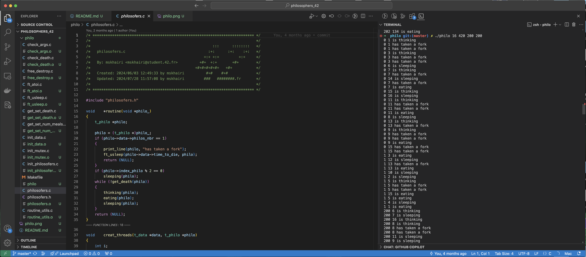

# Philosophers 42 Project

 
  

## Project Overview

The <strong>Philosophers 42</strong> project is a classic synchronization problem known as the "Dining Philosophers Problem." The objective is to solve a concurrency challenge where multiple philosophers sit at a table, alternating between thinking and eating, while competing for limited resources (forks). This project strengthens understanding of multithreading, process synchronization, and resource sharing using mutexes and semaphores in C.

## Features

<ul>
  <li>Implements the dining philosophers problem with a variable number of philosophers and forks.</li>
  <li>Uses threads to simulate the philosophers' behaviors of eating, thinking, and sleeping.</li>
  <li>Ensures no deadlock occurs by handling resource contention and synchronization correctly.</li>
  <li>Manages race conditions and avoids starvation through the use of mutexes or semaphores.</li>
  <li>Supports customizable parameters such as the number of philosophers, time to eat, time to think, and time to die.</li>
</ul>

## Installation

To install and run this project:

<pre>
git clone https://github.com/mahmoudskhairi/philosophers_42.git
cd philosophers_42
cd philo
make
</pre>

## Usage

Here’s an example of how to run the <code>philosophers</code> program:

<pre>
# Example usage with 5 philosophers, 800ms to die, 200ms to eat, 200ms to sleep
./philosophers 5 800 200 200

# With an optional number of times each philosopher must eat (e.g., 5)
./philosophers 5 800 200 200 5
</pre>

### Examples with simulations

#### ==> Example1

  

#### ==> Simulation1

  

#### ==> Example2

  

#### ==> Simulation2

  

The program simulates the philosophers' actions, ensuring proper synchronization and avoiding deadlock or resource starvation.

## Contact

For any questions, feedback, or issues, feel free to reach out:

<ul>
  <li>Email: <a href="mailto:mahmoud.skhairi@gmail.com">mahmoud.skhairi@gmail.com</a></li>
  <li>LinkedIn: <a href="https://www.linkedin.com/in/mahmoud-skhairi" target="_blank">mahmoud skhairi</a></li>
</ul>

<h2>Happy Coding!</h2>
